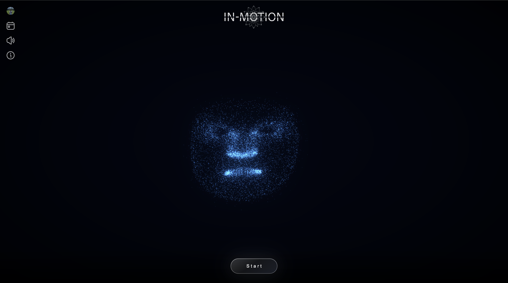

# IN-Motion

<p align="center">
  
</p>

Esperienza interattiva di meditazione guidata con intelligenza artificiale, visualizzazioni a particelle e riconoscimento facciale e vocale.

<p align="center">
  
</p>

---

## Requisiti

- **macOS** 10.14 o superiore (consigliato)
- **Python 3.10+** — [python.org/downloads](https://python.org/downloads)
- Connessione internet (prima installazione e API cloud)
- Chiave **Anthropic** — [console.anthropic.com](https://console.anthropic.com)
- Chiave **ElevenLabs** (voce) — [elevenlabs.io](https://elevenlabs.io)  
  Opzionale: **Firebase** per login e storico sessioni

---

## Installazione e avvio

### 1. Configura le chiavi

Nella cartella principale, file `.env`:

```
ANTHROPIC_API_KEY=sk-ant-...
ELEVENLABS_API_KEY=sk_...
```

(Opzionale: variabili `FIREBASE_*` da console Firebase.)

### 2. Avvia

**Doppio clic** su `Lancia IN-Motion.command`  
oppure da Terminale:

```bash
cd /percorso/IN-Motion/web/backend
python3 -m pip install -r requirements.txt   # solo la prima volta
python3 -m uvicorn server:app --host 0.0.0.0 --port 8080
```

Poi apri **http://localhost:8080**.

La prima volta scarica dipendenze e il modello Whisper (~500 MB).  
Ferma il server con **Ctrl+C**.

> Se macOS blocca il `.command`: **Impostazioni di Sistema → Privacy e sicurezza → Apri comunque**.

---

## Come si usa

1. Accedi (se Firebase è configurato) e completa il profilo
2. Clicca **Start** e segui le istruzioni a schermo
3. Chiudi gli occhi e racconta a voce ciò che porti; l’esperienza guida voce, musica e particelle (~10–15 min)
4. A fine sessione: riflessione, grafici emotivi e storico

> Cuffie e spazio tranquillo; concedi microfono e webcam al browser. La webcam non registra video.

---

## API e strumenti

| Componente | Ruolo |
|---|---|
| **Anthropic Claude** | Genera frasi, mandala (petali/colore) e quadrante emotivo Q1–Q4 dal racconto; analisi emotiva post-sessione |
| **ElevenLabs** | Sintesi vocale della guida |
| **faster-whisper** | Trascrizione del racconto / riflessione (locale) |
| **MediaPipe Face Landmarker** | 478 landmark + 52 blend shapes; mesh del volto a particelle e stima valenza/arousal |
| **Three.js** | Rendering WebGL delle particelle (blending additivo, bloom) |
| **Firebase** (opz.) | Auth e salvataggio sessioni / calendario |
| **FastAPI + Uvicorn** | Backend e WebSocket verso il browser |

Stack di supporto: **NumPy**, **Pillow**, libreria musicale WAV in `visuals/musica_libreria/`.

---

## Risoluzione problemi

| Problema | Soluzione |
|---|---|
| "Python 3 non trovato" | Installa da [python.org/downloads](https://python.org/downloads) |
| Il browser non si apre | Apri manualmente `http://localhost:8080` |
| Nessuna musica | Verifica `visuals/musica_libreria/` con i file WAV |
| Microfono / webcam | Concedi l’accesso nel browser |
| Errore API Anthropic / ElevenLabs | Controlla le chiavi nel `.env` |
